# ThemeKit

> **Native, brand-neutral SwiftUI design system** — 175 token-bound components that
> re-skin from a single accent color: light/dark, per-subtree, zero core dependencies.

[](https://github.com/isamercan/ThemeKit/actions/workflows/ci.yml)


[](LICENSE)
[](https://www.npmjs.com/package/@isamercan/themekit-mcp)

**[Docs](https://isamercan.github.io/ThemeKit/) · [API (DocC)](https://isamercan.github.io/ThemeKit/api/documentation/themekit) · [Wiki](https://github.com/isamercan/ThemeKit/wiki) · [npm (MCP)](https://www.npmjs.com/package/@isamercan/themekit-mcp) · [Releases](https://github.com/isamercan/ThemeKit/releases) · [Issues](https://github.com/isamercan/ThemeKit/issues) · [Changelog](CHANGELOG.md)**

<p align="center">
  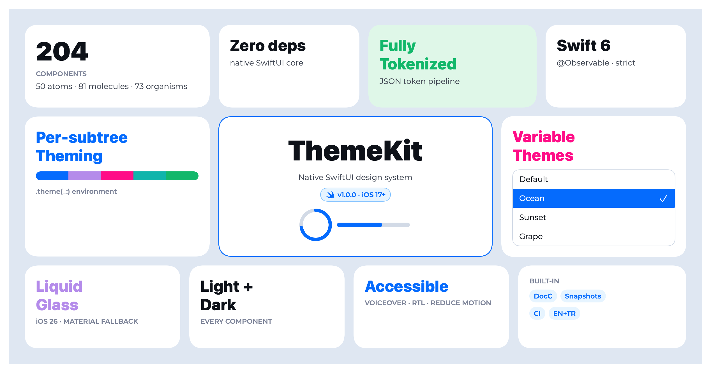
</p>

> The banner above is rendered **by ThemeKit itself** (its own tokens + components) — the same render pipeline that paints every tile in the gallery.

A theme-driven, **brand-neutral** SwiftUI component library. Every color,
typography, spacing, radius and shadow is a **design token** resolved at runtime
from the active `Theme`, so the whole UI re-skins from a single accent color —
without touching component code. **Components never hardcode a color** — swap the
theme and everything follows.

```swift
import ThemeKit
```

## Features

- 🎨 **Figma → ThemeKit** — `design_via_figma_mcp` reads a design *through a Figma
  MCP server*, the LLM maps it to idiomatic ThemeKit, and the server verifies it
  (`get_component_api` / `validate_code`); see the **Advanced — Figma & MCP** section.
- 🔁 **Code ⇄ Figma round-trip** — `export_figma_variables` turns the token catalog
  + 32 presets into a themeable **Figma Variables** library (one mode per preset);
  `import_figma_variables` pulls any company's Figma file back into a live
  `ThemeConfig` that re-skins every component. One vocabulary, both directions.
- 🪄 **Design Mode** — point ThemeKit at a free-form `design.md` (or a bundled style
  — Linear, Notion, iOS, Brutalist, Pastel) and it re-skins **every** component to
  match, via an offline heuristic parser (+ an optional LLM path).
- 🤖 **AI-native** — a 22-tool **MCP server**, a Claude Code **Agent skill**, and an
  **`llms.txt`**, so agents generate correct, token-bound UI — all from one source.
- 🧩 **Design tokens everywhere** — colors / radius / spacing from JSON, typography /
  shadows in code; one semantic name (`fg-hero`, `rd-sm`), different values per theme.
- 🌈 **33 theme presets** — ThemeKit's Default plus 32 ready-made color sets
  (cupcake, dracula, cyberpunk, nord…) inspired by [daisyUI](https://daisyui.com/docs/themes/), each recoloring the
  whole Ant-style palette on device.
- 📸 **Snapshot + render testing** — every component renders to a theme-aware PNG via
  `ImageRenderer`; the suite guards tokens, themes, validation and renders.
- **204 components** — Atoms / Molecules / Organisms, all token-bound.
- 🧬 **Flexibility architecture** — six archetype style protocols (`CardStyle`,
  `FieldStyle`, `ChipStyle`, `BarStyle`, `MeterStyle`, `ToastStyle`,
  `ListRowStyle`) let you re-skin a whole component family with `.cardStyle(_:)`
  / `.fieldStyle(_:)` / etc., `ViewBuilder` slots (`.leading{}`, `.trailing{}`,
  `.empty{}`…) inject custom content, and config modifiers accept theme tokens
  (`.spacing(SpacingKey)`, `.cornerRadius(RadiusRole)`) alongside raw values —
  all additive, defaults pixel-identical.
- **Runtime theming** — a Swift token generator + a live configurator turn any
  accent (or `base-100`) color into a full Ant-style palette on device (no Python,
  no baked files).
- **Validation** — pure, testable predicates + a SwiftUI presentation layer.
- **Accessibility** — Dynamic Type and Reduce Motion honored throughout.
- **Localization** — English-default strings via a bundled String Catalog;
  translate the **entire library** by dropping one `ThemeKit.xcstrings` into your
  app (no per-call code), with **restart-free** in-app language switching. Every
  default is also overridable per call.
- 📅 **Calendar add-on** — `ThemeKitCalendar` adds a token-bound date-range picker
  (`DateRangePicker`, built on [Almanac](https://github.com/isamercan/Almanac)) that
  re-skins with the active theme; opt-in, iOS-only.
- **Zero-dependency core** — Lottie and the Calendar are opt-in, separate products.
- **DocC catalog**, a demo app, and a test suite.

## Requirements

| | |
|---|---|
| Platforms | iOS 17+ · macOS 14+ |
| Swift tools | 6.2 |
| Dependencies | none (core) · `lottie-ios` 4.4.0+ (Lottie add-on) · `Almanac` 0.2.0+ (Calendar add-on, iOS-only) |

## Installation

Swift Package Manager. In **Xcode**: *File ▸ Add Package Dependencies…* and enter
the repository URL, or add it to your `Package.swift`:

```swift
dependencies: [
    // Core only — a plain install resolves ZERO third-party packages.
    .package(url: "https://github.com/isamercan/ThemeKit.git", from: "1.1.0"),

    // Opt into an add-on's dependency via package traits (Swift 6.1+):
    // .package(url: "https://github.com/isamercan/ThemeKit.git", from: "1.1.0",
    //          traits: ["Lottie", "Calendar"]),
],
targets: [
    .target(
        name: "MyApp",
        dependencies: [
            .product(name: "ThemeKit", package: "ThemeKit"),
            // Or, for just the theme layer (tokens + @Environment(\.theme), no components):
            // .product(name: "ThemeKitCore", package: "ThemeKit"),
            // Only with the matching trait enabled above:
            // .product(name: "ThemeKitLottie", package: "ThemeKit"),
            // .product(name: "ThemeKitCalendar", package: "ThemeKit"),
        ]
    ),
]
```

### Products & traits

The core is dependency-free **at resolution time**: the add-ons live behind opt-in
[package traits](https://github.com/swiftlang/swift-evolution/blob/main/proposals/0450-swiftpm-package-traits.md),
so without a trait enabled SwiftPM never even fetches Lottie or Almanac.

| Product | Trait | Pulls | Use |
|---|---|---|---|
| `ThemeKit` | — (default) | **nothing** | the full design system — tokens **and** all 204 components (re-exports `ThemeKitCore`) |
| `ThemeKitCore` | — (default) | **nothing** | token-only theme engine: `Theme`, `SemanticColor`, `@Environment(\.theme)`, presets, generator — **no components**. Adopt alone for a minimal theme layer. |
| `ThemeKitLottie` | `Lottie` | `lottie-ios` | Lottie (After Effects / JSON) animation views |
| `ThemeKitCalendar` | `Calendar` | `Almanac` (→ `HorizonCalendar`, iOS-only) | a token-bound date-range calendar (`DateRangePicker`) that re-skins with the active theme |

## Quick start

Install the theme once at the root, then build with token-bound views:

```swift
@main
struct MyApp: App {
    init() { Theme.shared.applyPersistedConfig() }   // restore last-used theme (optional)
    var body: some Scene {
        WindowGroup {
            ContentView().themeKit()            // inject + repaint on theme change
        }
    }
}

struct ContentView: View {
    @ThemeContext private var theme
    var body: some View {
        VStack(spacing: theme.spacing(.md)) {
            Text("Welcome").textStyle(.headingBase)
            PrimaryButton("Get started") { await signIn() }
        }
        .padding(theme.spacing(.base))
        .background(theme.background(.bgWhite))
        .cornerRadius(.base)
        .themeShadow(.elevated)
    }
}

Theme.shared.loadTheme(named: "oceanTheme")          // runtime switch
```

## Per-subtree theming

Theming isn't just a global switch — any `Theme` can be injected into a single
subtree with `.theme(_:)`, and every component inside re-skins to it. No
`Theme.shared` mutation, no global state; the rest of the app keeps its theme.

```swift
let ocean = Theme(); ocean.loadTheme(named: "oceanTheme")
let grape = Theme(); grape.applyGenerated(primaryHex: "#7C3AED")   // generated on-device

HStack {
    BookingCard(...)                 // app theme
    BookingCard(...).theme(ocean)    // ocean — this subtree only
    BookingCard(...).theme(grape)    // grape — this subtree only
}
```

The same components, four injected themes, one screen — brand colors follow the
injected theme while semantic colors (info, success…) stay consistent:

<p align="center">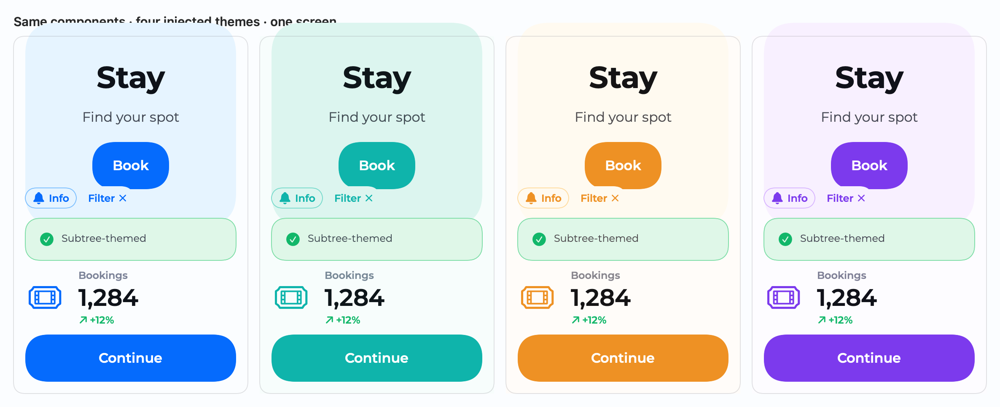</p>

Every component reads `@Environment(\.theme)` (default `Theme.shared`), so this is
additive and backward-compatible. Try it live in the gallery's **Theme Injection** page.

## Theme presets

ThemeKit ships 33 ready-made theme presets — its **Default** plus **32 color sets
inspired by [daisyUI](https://daisyui.com/docs/themes/)** (cupcake, dracula, cyberpunk, synthwave, nord, coffee…). Each is a
`ThemePreset` recipe: its accent recolors the whole Ant-style palette and its
`base-100` becomes the surface tone, so every theme keeps its signature look —
**cupcake stays cream, cyberpunk yellow, dracula slate**. The *same components*,
four injected themes:

<p align="center">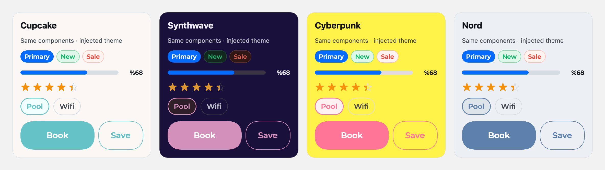</p>

Apply one live, or drop the bundled **`ThemePicker`** into any screen for a
theme switcher (it's the demo app's **Themes** tab):

```swift
ThemePreset.named("dracula")?.apply()        // recolors Theme.shared on the fly

@State private var active: String? = "cupcake"
ThemePicker(selection: $active)             // a tappable grid of all 33 themes
```

<p align="center">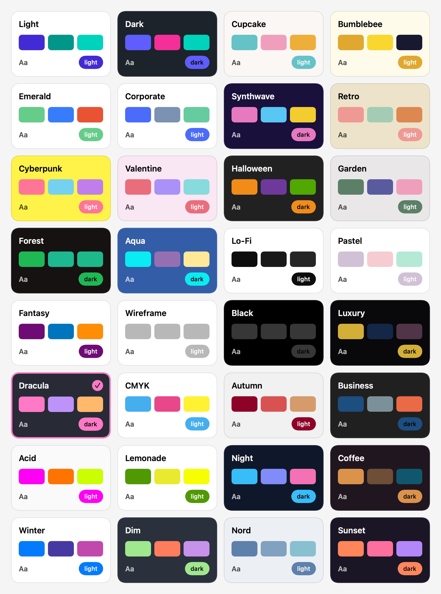</p>

## Screenshots

The demo app on device — the component catalog, live theming, the design-token
gallery, and a full booking flow built entirely from ThemeKit components.

<table>
<tr>
<td align="center" valign="top" width="25%">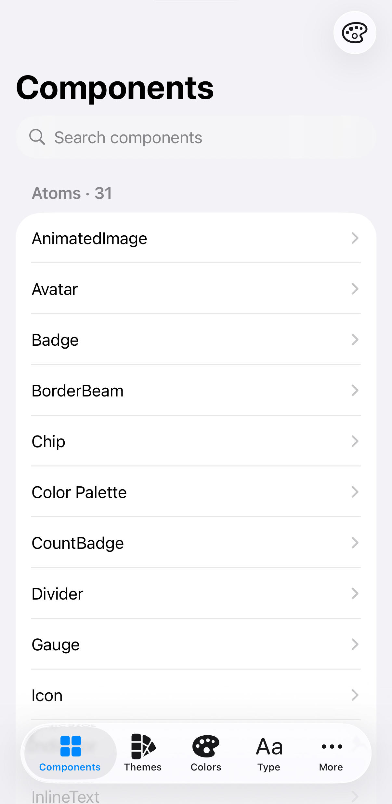<br><sub><b>Component catalog</b></sub></td>
<td align="center" valign="top" width="25%">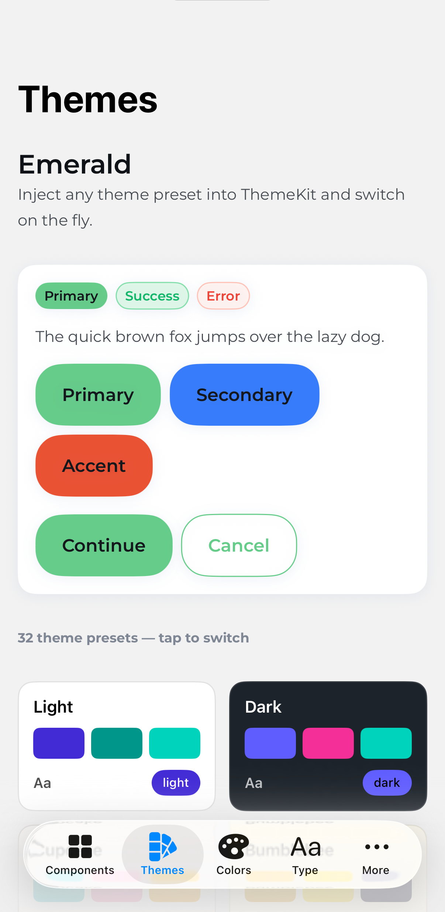<br><sub><b>Live theming · 33 presets</b></sub></td>
<td align="center" valign="top" width="25%">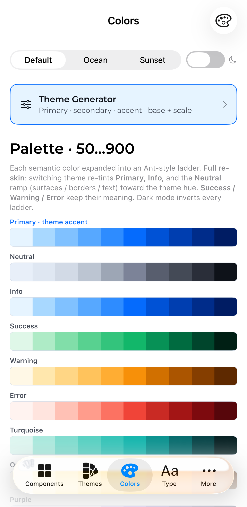<br><sub><b>Design-token gallery</b></sub></td>
<td align="center" valign="top" width="25%">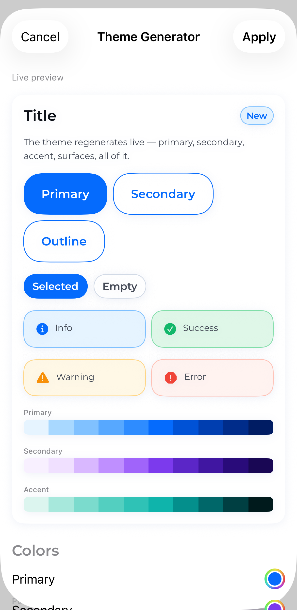<br><sub><b>Theme Generator</b></sub></td>
</tr>
<tr>
<td align="center" valign="top" width="25%">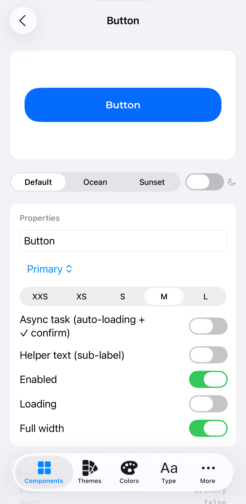<br><sub><b>Button · variants</b></sub></td>
<td align="center" valign="top" width="25%">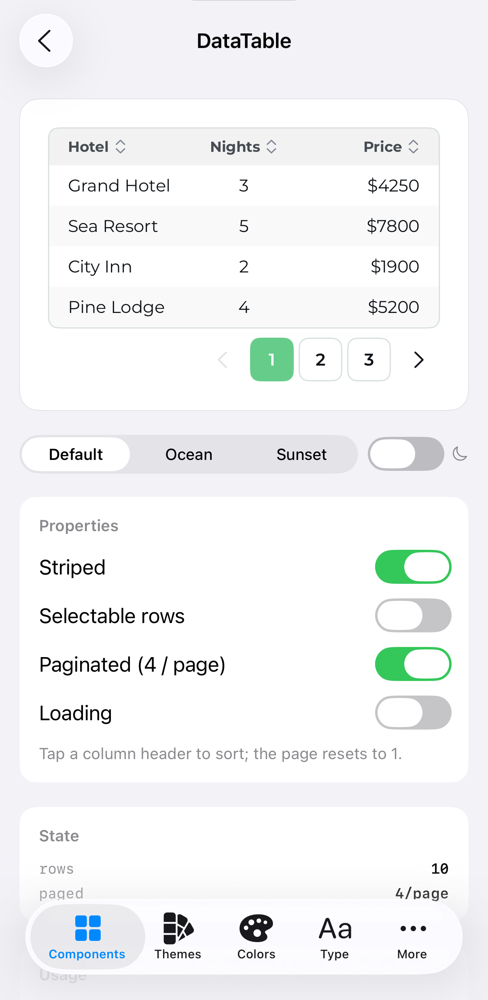<br><sub><b>DataTable · sort/paginate</b></sub></td>
<td align="center" valign="top" width="25%">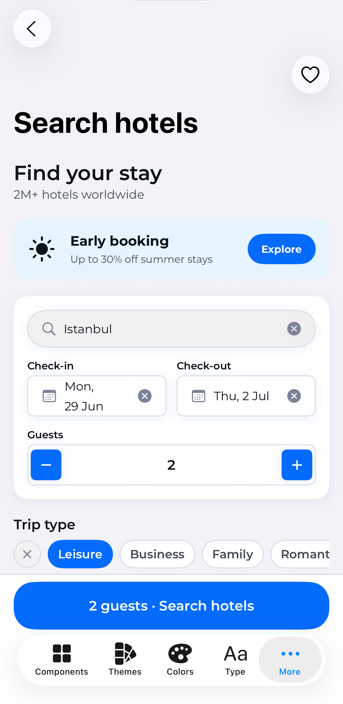<br><sub><b>Example · search</b></sub></td>
<td align="center" valign="top" width="25%">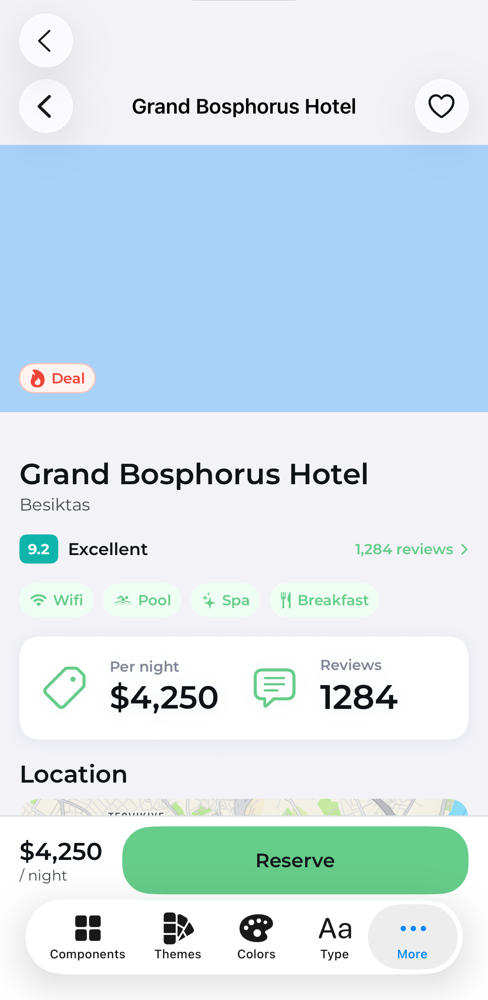<br><sub><b>Example · detail</b></sub></td>
</tr>
</table>

> Real screens from the bundled [Demo](#demo) app, not mockups — every pixel is
> a ThemeKit component reading live design tokens.

## Components

175 token-bound components, grouped by complexity:

- **Atoms** (44) — `Badge`, `Chip`, `Avatar`, `Icon`, `Rating`, `Spinner`,
  `StatusDot`, `ProgressBar`, `PriceTag`, `PointsBadge`, `CountdownTimer`, `QRCode`, `Barcode`,
  `Aura`, `TiltCard`, `CodeBlock`…
- **Molecules** (64) — `TextInput`, `OTPInput`, `Select`, `Checkbox`, `RangeSlider`,
  `SearchBar`, `TimeField`, `GuestSelector`, `PriceHistogram`, `InstallmentSelector`, `CurrencyPicker`,
  `Dropdown`, `ScrubGallery`, buttons…
- **Organisms** (67) — `Card`, `Carousel`, `DataTable`, `Accordion`, `Timeline`,
  `NavigationBar`, `Sidebar`, `FlightCard`, `FareSummary`, `ReviewCard`, `LoyaltyCard`, `SeatMap`, `LocationCard`,
  `HotelResultCard`, `BoardingPass`, `BrowserFrame`, `WindowFrame`, `PhoneFrame`…

Every component is curated by category in the [DocC catalog](#documentation), and
listed with a verified usage snippet on the docs site —
[Atoms](https://isamercan.github.io/ThemeKit/components/atoms/) ·
[Molecules](https://isamercan.github.io/ThemeKit/components/molecules/) ·
[Organisms](https://isamercan.github.io/ThemeKit/components/organisms/).

## Component gallery

Rendered straight from the library via `ImageRenderer` (plain `` so they render everywhere, including the GitHub mobile app) —
regenerate with `make screenshots`. Interactive overlays (Dialog, Drawer, Tour,
BottomSheet…) and media components are best seen live in the [Demo app](#demo).

<!-- GALLERY:START -->

### Atoms

<table>
<tr>
<td align="center" valign="top" width="33%"><br><sub><b>Avatar</b></sub></td>
<td align="center" valign="top" width="33%"><br><sub><b>Badge</b></sub></td>
<td align="center" valign="top" width="33%">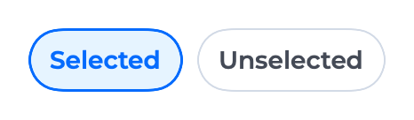<br><sub><b>Chip</b></sub></td>
</tr>
<tr>
<td align="center" valign="top" width="33%"><br><sub><b>CountBadge</b></sub></td>
<td align="center" valign="top" width="33%"><br><sub><b>Divider</b></sub></td>
<td align="center" valign="top" width="33%"><br><sub><b>Icon</b></sub></td>
</tr>
<tr>
<td align="center" valign="top" width="33%"><br><sub><b>Indicator</b></sub></td>
<td align="center" valign="top" width="33%">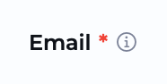<br><sub><b>InputLabel</b></sub></td>
<td align="center" valign="top" width="33%">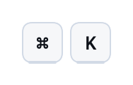<br><sub><b>Kbd</b></sub></td>
</tr>
<tr>
<td align="center" valign="top" width="33%">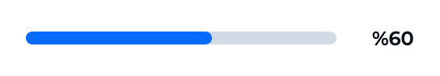<br><sub><b>ProgressBar</b></sub></td>
<td align="center" valign="top" width="33%">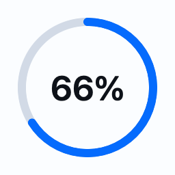<br><sub><b>RadialProgress</b></sub></td>
<td align="center" valign="top" width="33%">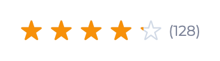<br><sub><b>Rating</b></sub></td>
</tr>
<tr>
<td align="center" valign="top" width="33%">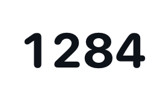<br><sub><b>RollingNumber</b></sub></td>
<td align="center" valign="top" width="33%">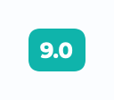<br><sub><b>ScoreBadge</b></sub></td>
<td align="center" valign="top" width="33%">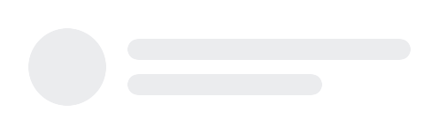<br><sub><b>Skeleton</b></sub></td>
</tr>
<tr>
<td align="center" valign="top" width="33%"><br><sub><b>Spinner</b></sub></td>
<td align="center" valign="top" width="33%">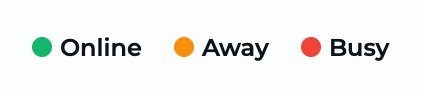<br><sub><b>StatusDot</b></sub></td>
<td align="center" valign="top" width="33%">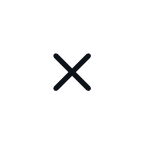<br><sub><b>Swap</b></sub></td>
</tr>
<tr>
<td align="center" valign="top" width="33%"><br><sub><b>Tag</b></sub></td>
<td align="center" valign="top" width="33%">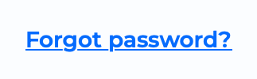<br><sub><b>TextLink</b></sub></td>
<td align="center" valign="top" width="33%"><br><sub><b>Title</b></sub></td>
</tr>
<tr>
<td align="center" valign="top" width="33%">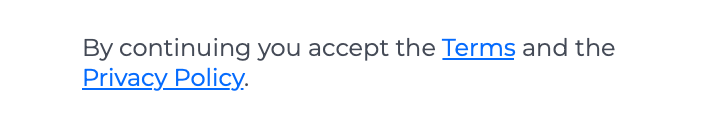<br><sub><b>InlineText</b></sub></td>
<td align="center" valign="top" width="33%">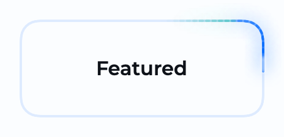<br><sub><b>BorderBeam</b></sub></td>
<td align="center" valign="top" width="33%">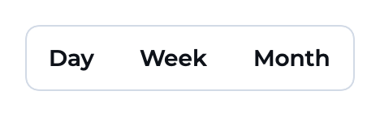<br><sub><b>Join</b></sub></td>
</tr>
<tr>
<td align="center" valign="top" width="33%">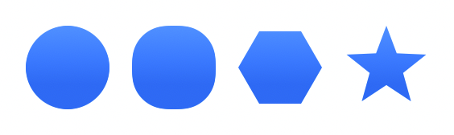<br><sub><b>Mask</b></sub></td>
<td align="center" valign="top" width="33%"><br><sub><b>TextRotate</b></sub></td>
<td align="center" valign="top" width="33%">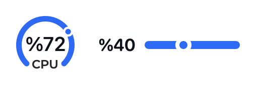<br><sub><b>Gauge</b></sub></td>
</tr>
<tr>
<td align="center" valign="top" width="33%">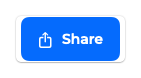<br><sub><b>ShareButton</b></sub></td>
<td align="center" valign="top" width="33%">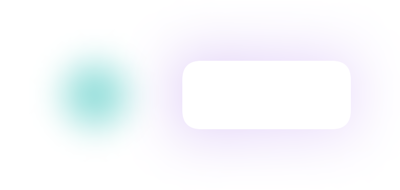<br><sub><b>Aura</b></sub></td>
<td align="center" valign="top" width="33%">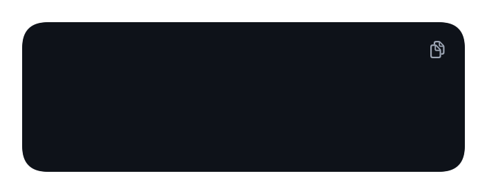<br><sub><b>CodeBlock</b></sub></td>
</tr>
<tr>
<td align="center" valign="top" width="33%"><br><sub><b>Confetti</b></sub></td>
<td align="center" valign="top" width="33%">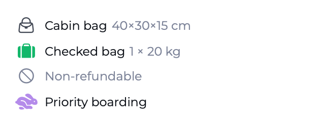<br><sub><b>FareFeatureRow</b></sub></td>
<td align="center" valign="top" width="33%">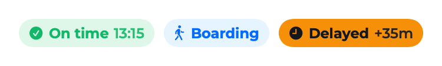<br><sub><b>FlightStatusBadge</b></sub></td>
</tr>
<tr>
<td align="center" valign="top" width="33%">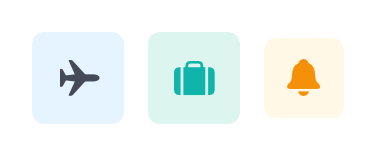<br><sub><b>IconTile</b></sub></td>
<td align="center" valign="top" width="33%">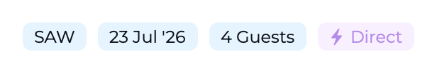<br><sub><b>SearchBadge</b></sub></td>
<td align="center" valign="top" width="33%">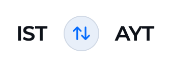<br><sub><b>SwapButton</b></sub></td>
</tr>
<tr>
<td align="center" valign="top" width="33%"><br><sub><b>TiltCard</b></sub></td>
<td align="center" valign="top" width="33%"><br><sub><b>Watermark</b></sub></td>
</tr>
</table>

### Molecules

<table>
<tr>
<td align="center" valign="top" width="33%">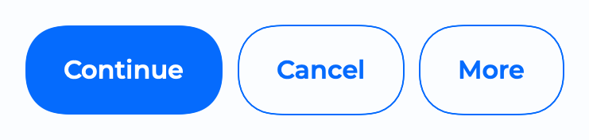<br><sub><b>Button</b></sub></td>
<td align="center" valign="top" width="33%">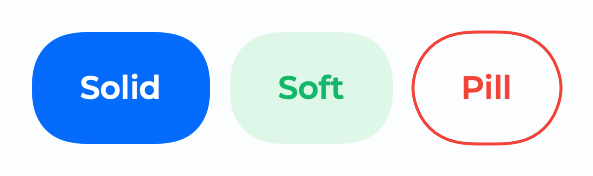<br><sub><b>ThemeButton</b></sub></td>
<td align="center" valign="top" width="33%">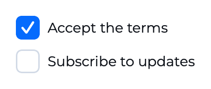<br><sub><b>Checkbox</b></sub></td>
</tr>
<tr>
<td align="center" valign="top" width="33%">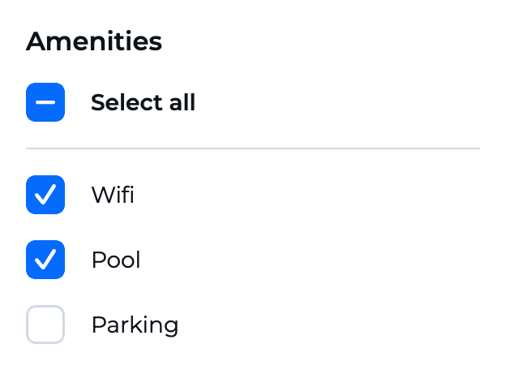<br><sub><b>CheckboxGroup</b></sub></td>
<td align="center" valign="top" width="33%">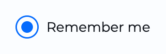<br><sub><b>RadioButton</b></sub></td>
<td align="center" valign="top" width="33%">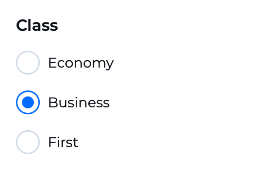<br><sub><b>RadioGroup</b></sub></td>
</tr>
<tr>
<td align="center" valign="top" width="33%">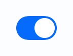<br><sub><b>ToggleGroup</b></sub></td>
<td align="center" valign="top" width="33%">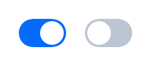<br><sub><b>ThemeToggle</b></sub></td>
<td align="center" valign="top" width="33%">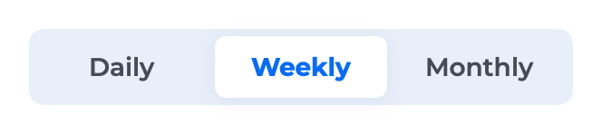<br><sub><b>SegmentedControl</b></sub></td>
</tr>
<tr>
<td align="center" valign="top" width="33%">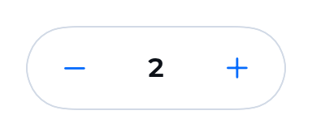<br><sub><b>QuantityStepper</b></sub></td>
<td align="center" valign="top" width="33%">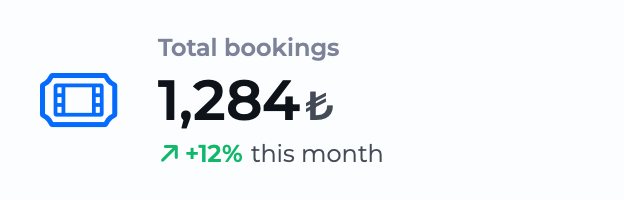<br><sub><b>Stat</b></sub></td>
<td align="center" valign="top" width="33%">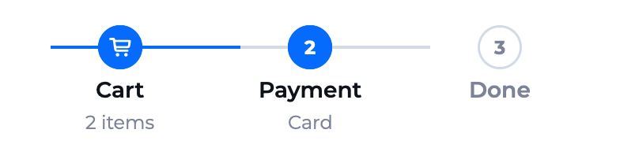<br><sub><b>Steps</b></sub></td>
</tr>
<tr>
<td align="center" valign="top" width="33%">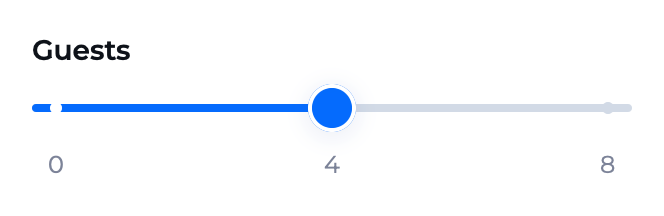<br><sub><b>Slider</b></sub></td>
<td align="center" valign="top" width="33%"><br><sub><b>Breadcrumbs</b></sub></td>
<td align="center" valign="top" width="33%"><br><sub><b>TextInput</b></sub></td>
</tr>
<tr>
<td align="center" valign="top" width="33%"><br><sub><b>FileInput</b></sub></td>
<td align="center" valign="top" width="33%"><br><sub><b>Pagination</b></sub></td>
<td align="center" valign="top" width="33%"><br><sub><b>Fieldset</b></sub></td>
</tr>
<tr>
<td align="center" valign="top" width="33%"><br><sub><b>DateField</b></sub></td>
<td align="center" valign="top" width="33%"><br><sub><b>Select</b></sub></td>
<td align="center" valign="top" width="33%"><br><sub><b>MultiSelect</b></sub></td>
</tr>
<tr>
<td align="center" valign="top" width="33%"><br><sub><b>TreeSelect</b></sub></td>
<td align="center" valign="top" width="33%"><br><sub><b>Autocomplete</b></sub></td>
<td align="center" valign="top" width="33%"><br><sub><b>SearchBar</b></sub></td>
</tr>
<tr>
<td align="center" valign="top" width="33%"><br><sub><b>OTPInput</b></sub></td>
<td align="center" valign="top" width="33%"><br><sub><b>InputNumber</b></sub></td>
<td align="center" valign="top" width="33%"><br><sub><b>RangeSlider</b></sub></td>
</tr>
<tr>
<td align="center" valign="top" width="33%"><br><sub><b>MultiLineTextInput</b></sub></td>
<td align="center" valign="top" width="33%"><br><sub><b>Tooltip</b></sub></td>
<td align="center" valign="top" width="33%"><br><sub><b>Chips</b></sub></td>
</tr>
<tr>
<td align="center" valign="top" width="33%"><br><sub><b>FilterGroup</b></sub></td>
<td align="center" valign="top" width="33%"><br><sub><b>ProgressIndicator</b></sub></td>
<td align="center" valign="top" width="33%"><br><sub><b>ThemeController</b></sub></td>
</tr>
<tr>
<td align="center" valign="top" width="33%"><br><sub><b>Calendar</b></sub></td>
<td align="center" valign="top" width="33%"><br><sub><b>ColorField</b></sub></td>
<td align="center" valign="top" width="33%"><br><sub><b>DatePriceCard</b></sub></td>
</tr>
<tr>
<td align="center" valign="top" width="33%"><br><sub><b>DatePriceStrip</b></sub></td>
<td align="center" valign="top" width="33%"><br><sub><b>Dropdown</b></sub></td>
<td align="center" valign="top" width="33%"><br><sub><b>FieldButton</b></sub></td>
</tr>
<tr>
<td align="center" valign="top" width="33%"><br><sub><b>FilterRow</b></sub></td>
<td align="center" valign="top" width="33%"><br><sub><b>FlightRoute</b></sub></td>
<td align="center" valign="top" width="33%"><br><sub><b>InstallmentPicker</b></sub></td>
</tr>
<tr>
<td align="center" valign="top" width="33%"><br><sub><b>LayoverRow</b></sub></td>
<td align="center" valign="top" width="33%"><br><sub><b>MapPriceMarker</b></sub></td>
<td align="center" valign="top" width="33%"><br><sub><b>PassengerRow</b></sub></td>
</tr>
<tr>
<td align="center" valign="top" width="33%"><br><sub><b>PaymentCardField</b></sub></td>
<td align="center" valign="top" width="33%"><br><sub><b>PriceBreakdown</b></sub></td>
<td align="center" valign="top" width="33%"><br><sub><b>PriceTrendChart</b></sub></td>
</tr>
<tr>
<td align="center" valign="top" width="33%"><br><sub><b>RecentSearchRow</b></sub></td>
<td align="center" valign="top" width="33%"><br><sub><b>ScrubGallery</b></sub></td>
<td align="center" valign="top" width="33%"><br><sub><b>SearchField</b></sub></td>
</tr>
<tr>
<td align="center" valign="top" width="33%"><br><sub><b>SmartSuggestion</b></sub></td>
<td align="center" valign="top" width="33%"><br><sub><b>SortSummaryBar</b></sub></td>
<td align="center" valign="top" width="33%"><br><sub><b>SortTab</b></sub></td>
</tr>
<tr>
<td align="center" valign="top" width="33%"><br><sub><b>StepperRow</b></sub></td>
<td align="center" valign="top" width="33%"><br><sub><b>SuggestionRow</b></sub></td>
<td align="center" valign="top" width="33%"><br><sub><b>TripTypeToggle</b></sub></td>
</tr>
<tr>
<td align="center" valign="top" width="33%"><br><sub><b>Space</b></sub></td>
<td align="center" valign="top" width="33%"><br><sub><b>Flex</b></sub></td>
<td align="center" valign="top" width="33%"><br><sub><b>Anchor</b></sub></td>
</tr>
<tr>
<td align="center" valign="top" width="33%"><br><sub><b>Splitter</b></sub></td>
<td align="center" valign="top" width="33%"><br><sub><b>Cascader</b></sub></td>
<td align="center" valign="top" width="33%"><br><sub><b>Transfer</b></sub></td>
</tr>
<tr>
<td align="center" valign="top" width="33%"><br><sub><b>Mentions</b></sub></td>
<td align="center" valign="top" width="33%"><br><sub><b>Masonry</b></sub></td>
<td align="center" valign="top" width="33%"><br><sub><b>Tree</b></sub></td>
</tr>
<tr>
<td align="center" valign="top" width="33%"><br><sub><b>Grid</b></sub></td>
<td align="center" valign="top" width="33%"><br><sub><b>Affix</b></sub></td>
<td align="center" valign="top" width="33%"><br><sub><b>SearchSummary</b></sub></td>
</tr>
</table>

### Organisms

<table>
<tr>
<td align="center" valign="top" width="33%"><br><sub><b>Accordion</b></sub></td>
<td align="center" valign="top" width="33%"><br><sub><b>AlertToast</b></sub></td>
<td align="center" valign="top" width="33%"><br><sub><b>Callout</b></sub></td>
</tr>
<tr>
<td align="center" valign="top" width="33%"><br><sub><b>Card</b></sub></td>
<td align="center" valign="top" width="33%"><br><sub><b>ChatBubble</b></sub></td>
<td align="center" valign="top" width="33%"><br><sub><b>Counter</b></sub></td>
</tr>
<tr>
<td align="center" valign="top" width="33%"><br><sub><b>Coupon</b></sub></td>
<td align="center" valign="top" width="33%"><br><sub><b>EmptyState</b></sub></td>
<td align="center" valign="top" width="33%"><br><sub><b>InfoBanner</b></sub></td>
</tr>
<tr>
<td align="center" valign="top" width="33%"><br><sub><b>KeyValueTable</b></sub></td>
<td align="center" valign="top" width="33%"><br><sub><b>ListRow</b></sub></td>
<td align="center" valign="top" width="33%"><br><sub><b>NotificationCard</b></sub></td>
</tr>
<tr>
<td align="center" valign="top" width="33%"><br><sub><b>PageHeader</b></sub></td>
<td align="center" valign="top" width="33%"><br><sub><b>RatingSummary</b></sub></td>
<td align="center" valign="top" width="33%"><br><sub><b>ResultView</b></sub></td>
</tr>
<tr>
<td align="center" valign="top" width="33%"><br><sub><b>SegmentedTabBar</b></sub></td>
<td align="center" valign="top" width="33%"><br><sub><b>Timeline</b></sub></td>
<td align="center" valign="top" width="33%"><br><sub><b>Upload</b></sub></td>
</tr>
<tr>
<td align="center" valign="top" width="33%"><br><sub><b>PromoBanner</b></sub></td>
<td align="center" valign="top" width="33%"><br><sub><b>ListView</b></sub></td>
<td align="center" valign="top" width="33%"><br><sub><b>MenuCard</b></sub></td>
</tr>
<tr>
<td align="center" valign="top" width="33%"><br><sub><b>NavigationBar</b></sub></td>
<td align="center" valign="top" width="33%"><br><sub><b>FAB</b></sub></td>
<td align="center" valign="top" width="33%"><br><sub><b>Hero</b></sub></td>
</tr>
<tr>
<td align="center" valign="top" width="33%"><br><sub><b>SelectionCards</b></sub></td>
<td align="center" valign="top" width="33%"><br><sub><b>CardStack</b></sub></td>
<td align="center" valign="top" width="33%"><br><sub><b>Gallery</b></sub></td>
</tr>
<tr>
<td align="center" valign="top" width="33%"><br><sub><b>Footer</b></sub></td>
<td align="center" valign="top" width="33%"><br><sub><b>Diff</b></sub></td>
<td align="center" valign="top" width="33%"><br><sub><b>AgentPriceRow</b></sub></td>
</tr>
<tr>
<td align="center" valign="top" width="33%"><br><sub><b>AncillaryCard</b></sub></td>
<td align="center" valign="top" width="33%"><br><sub><b>BoardingPass</b></sub></td>
<td align="center" valign="top" width="33%"><br><sub><b>BrowserFrame</b></sub></td>
</tr>
<tr>
<td align="center" valign="top" width="33%"><br><sub><b>DestinationCard</b></sub></td>
<td align="center" valign="top" width="33%"><br><sub><b>FareFamilyCard</b></sub></td>
<td align="center" valign="top" width="33%"><br><sub><b>FilterBar</b></sub></td>
</tr>
<tr>
<td align="center" valign="top" width="33%"><br><sub><b>FilterList</b></sub></td>
<td align="center" valign="top" width="33%"><br><sub><b>FlightResultRow</b></sub></td>
<td align="center" valign="top" width="33%"><br><sub><b>FlightTicketCard</b></sub></td>
</tr>
<tr>
<td align="center" valign="top" width="33%"><br><sub><b>HotelResultCard</b></sub></td>
<td align="center" valign="top" width="33%"><br><sub><b>MapCallout</b></sub></td>
<td align="center" valign="top" width="33%"><br><sub><b>PhoneFrame</b></sub></td>
</tr>
<tr>
<td align="center" valign="top" width="33%"><br><sub><b>PriceAlertCard</b></sub></td>
<td align="center" valign="top" width="33%"><br><sub><b>RoomCard</b></sub></td>
<td align="center" valign="top" width="33%"><br><sub><b>SheetHeader</b></sub></td>
</tr>
<tr>
<td align="center" valign="top" width="33%"><br><sub><b>StickyBookingBar</b></sub></td>
<td align="center" valign="top" width="33%"><br><sub><b>TicketStub</b></sub></td>
<td align="center" valign="top" width="33%"><br><sub><b>FlightListItem</b></sub></td>
</tr>
<tr>
<td align="center" valign="top" width="33%"><br><sub><b>WindowFrame</b></sub></td>
</tr>
</table>

### Overlays (animated)

_Entrance previews rendered from the live components. SelectBox, BottomSheet, Tour and Feedback use OS-owned presentations (native `Menu` / `.sheet`) that no offscreen renderer can capture — record them from the running app with `make record-gif NAME=SelectBox` (boots the simulator, you tap to open the dropdown; see [docs/SCREENSHOTS.md](docs/SCREENSHOTS.md))._

<table>
<tr>
<td align="center" width="33%"><br><sub><b>Dialog</b></sub></td>
<td align="center" width="33%"><br><sub><b>Drawer</b></sub></td>
<td align="center" width="33%"><br><sub><b>Popconfirm</b></sub></td>
</tr>
<tr>
<td align="center" width="33%"><br><sub><b>AlertToast</b></sub></td>
<td align="center" width="33%"><br><sub><b>Tooltip</b></sub></td>
</tr>
</table>
<!-- GALLERY:END -->

## Token system

```
Sources/ThemeKit/
├─ Theme/              # Theme.shared, tokens, generator, configurator API
│  ├─ Theme.swift                 # ObservableObject singleton (Theme.shared)
│  ├─ ColorTokens.generated.swift # Foreground/Background/Border/Text color keys
│  ├─ ThemeModel.swift            # RadiusKey / SpacingKey
│  ├─ Typography.swift            # TextStyle ramp (Montserrat, Dynamic Type)
│  ├─ Shadows.swift               # ShadowStyle + .themeShadow()
│  ├─ SemanticColor.swift         # named palette colors
│  ├─ ThemeGenerator.swift        # runtime palette generator (Swift port)
│  ├─ ThemeConfig.swift           # Codable theme recipe
│  ├─ ThemeKit.swift         # .themeKit() root modifier
│  ├─ ThemeContext.swift          # @ThemeContext property wrapper
│  └─ ThemedHostingController.swift
├─ Components/         # Atoms / Molecules / Organisms (all token-bound)
├─ Validation/         # Validators / ValidationRule / Validator / InfoMessage
├─ Accessibility/      # Reduce Motion + Dynamic Type helpers
├─ Extensions/         # Color(hex:), AspectRatio, Motion, Grid
├─ Utils/              # Haptics, Impression, Localization bridge
├─ Documentation.docc/ # DocC catalog
└─ Resources/
   ├─ *.json                  # defaultTheme / oceanTheme / sunsetTheme (+ Dark)
   ├─ Localizable.xcstrings    # String Catalog (en source + tr)
   └─ Fonts/Montserrat.ttf     # bundled, registered at runtime
```

### Token groups

| Group | Source of truth | Keys |
|---|---|---|
| Colors | `Resources/*.json` | `Theme.ForegroundColorKey` · `BackgroundColorKey` · `BorderColorKey` · `TextColorKey` |
| Radius | `Resources/*.json` | `Theme.RadiusKey` (`rd-xs`…`rd-4xl`) |
| Spacing | `Resources/*.json` | `Theme.SpacingKey` (`sp-xs`…`sp-4xl`) |
| Typography | code (`Typography.swift`) | `TextStyle` — Display / Heading / Label / Body / Overline / Link |
| Shadows | code (`Shadows.swift`) | `ShadowStyle` — elevated / tabBar / soft |

Colors / radius / spacing vary per theme (JSON). Typography & shadows are
structural and constant across themes.

## Themes

`default` (blue) · `ocean` (turquoise) · `sunset` (orange) — each with a Dark
variant. Token **names** are semantic; only the values differ per theme. Add a
theme by dropping a `<name>Theme.json` into `Resources/`.

## Theming your app (Configurator export)

The library ships a **runtime token generator** (`ThemeGenerator`, a Swift port of
`tools/gen_tokens.py`): from a handful of inputs it regenerates the whole palette,
neutral ramp, surfaces, borders, text, and radius / spacing / font / shadow ramps
— on device, no Python and no baked palette files.

The Demo's **Theme Configurator** (Colors tab) lets you dial in an accent color +
tint + scale knobs + font + dark and exports a `ThemeConfig` recipe. To apply one:

```swift
// a) one-liner (paste the configurator's "Apply (Swift)" export)
Theme.shared.applyGenerated(primaryHex: "ff0d87", tint: 0.13, radiusScale: 1.0, font: "Montserrat")

// b) ship the Codable recipe as a resource (the configurator's `theme.json`)
let cfg = try ThemeConfig(jsonData: Data(contentsOf: themeJSONURL))
Theme.shared.apply(cfg)
Theme.shared.persistConfig()                            // remember across launches

// c) generator-free: bundle the pre-baked token JSON ("Copy full token JSON")
Theme.shared.setTheme(jsonData: Data(contentsOf: tokensURL))
```

`ThemeConfig` is `Codable` / `Sendable` / `Equatable` — persist it, sync it, A/B it.

### How live theming works

Components resolve tokens from the `Theme.shared` singleton (no per-call
environment lookups), so SwiftUI can't infer that an arbitrary view depends on the
theme. `.themeKit()` closes that gap: it injects `Theme` into the environment
**and** (by default) rebuilds the subtree keyed on `Theme.revision` when the theme
changes, so every view re-reads the regenerated tokens.

- Switching theme from a **settings screen** → keep the default
  (`reactToRuntimeChanges: true`); the whole UI repaints.
- Editing the theme **in-session** (a live editor/inspector) → use
  `.themeKit(reactToRuntimeChanges: false)` so the editor isn't torn down,
  and scope `.id(Theme.shared.revision)` onto just the live-preview subtree.

### Per-subtree theming (`\.theme`)

Components also read the theme from the `\.theme` environment value, which
**defaults to `Theme.shared`** (so unthemed components never crash). Inject a
different `Theme` instance to re-theme a branch — a second brand in one screen, or
a pinned theme in a preview/snapshot — without mutating global state:

```swift
SomeComponent()
    .theme(brandBTheme)        // this subtree only
```

This is migrating in: pilot components (`Card`, `Tag`) read `\.theme` today; the
rest still read `Theme.shared` directly and are moving over incrementally.

### Fonts

`Montserrat` is bundled. `System` / `SystemRounded` / `SystemSerif` / `SystemMono`
need nothing. Any other family must be registered by the host app (add the `.ttf` +
`UIAppFonts`), then pass its PostScript family name as `font:`.

## Accessibility

- **Dynamic Type** — the type ramp scales with the user's preferred text size:
  each `TextStyle` anchors to a semantic `Font.TextStyle` via `relativeTo:`. At the
  default size nothing changes; it only grows/shrinks when the user opts in. Clamp
  per-screen if needed: `MyScreen().dynamicTypeSize(...DynamicTypeSize.accessibility2)`.
- **Reduce Motion** — decorative/continuous animation is suppressed while
  functional motion is kept: `BorderBeam`, `Skeleton`, `RollingNumber`, `StatusDot`,
  `Carousel` autoplay, the OTP caret all calm down; `Spinner` keeps spinning.

No caller configuration is required — components read the environment directly.

## Validation

A pure logic layer (no SwiftUI, no theme) plus a separate presentation layer:

```swift
let messages = Validator.validate(email, [.required(), .email()])   // [InfoMessage]
InfoMessageList(messages)                                            // SwiftUI rendering
```

Feed your own logic — a custom predicate, a regex, a typed `Regex`, or an async
(server-side) check:

```swift
.regex("^[a-z]+$", caseInsensitive: true, "letters only")
ValidationRule("only AAA") { $0 == "AAA" }
let unique = AsyncValidationRule("Username taken") { await api.isAvailable($0) }
```

`FormValidator` ties fields, rules, focus and messages together for a whole form.

## Localization

Every user-facing default string (validation messages, placeholders, VoiceOver
labels…) flows through **one bridge** and resolves against a **String Catalog**
(source language **English**). So you translate the **whole library into any
language — with no per-call code** — by adding a single language file to your app.

### Add a language — step by step

**1. Create the language file.** In your **app** target: *File → New → String
Catalog*, name it exactly **`ThemeKit.xcstrings`**. The file name is the strings-table
name; ThemeKit looks up the `"ThemeKit"` table in `Bundle.main` by default — so there
is **nothing to register**. Start from the shipped template
[`docs/templates/ThemeKit.xcstrings`](docs/templates/ThemeKit.xcstrings) — the
always-current key set, regenerated from source by `make l10n` — so you never guess a
key.

**2. Translate the keys.** Open it in Xcode's String Catalog editor, press **＋**, add
your language, fill the column. Keys **are** ThemeKit's English strings (`Card number`,
`Select`, `Promo code:`). Interpolated keys use `%@` for every value
(`"%@ installments"`, `"Total: %@"`) — reorder with `%1$@`/`%2$@`. Keep the template's
`"generatesSymbol": false` (avoids an Xcode symbol-name collision on the key set).

```json
{
  "sourceLanguage" : "en",
  "version" : "1.0",
  "strings" : {
    "Card number" : { "localizations" : {
      "tr" : { "stringUnit" : { "state" : "translated", "value" : "Kart numarası" } } } },
    "Select" : { "localizations" : {
      "tr" : { "stringUnit" : { "state" : "translated", "value" : "Seç" } } } }
  }
}
```

**3. Build.** When the device/per-app language matches, **all of ThemeKit renders that
language**. Untranslated keys fall back to English, per key. That's it — no code.

### Restart-free in-app switch (optional)

For an in-app language picker that flips the whole UI live (no relaunch):

```swift
RootView().themeKitLocalized()                                 // root provider, once
LanguageSwitcher([.init(code: "en"), .init(code: "tr")],
                 selection: ThemeKitStrings.languageBinding)   // flips the whole UI live
```

### Loading the file from elsewhere (extensions / frameworks)

Zero-config assumes `Bundle.main` + table `"ThemeKit"`. If your catalog ships in an app
**extension** (whose `.main` is the extension) or in a **framework** that embeds
ThemeKit, or you use a different table name, point ThemeKit at it once at launch:

```swift
ThemeKitStrings.register(bundle: .myFrameworkBundle, table: "ThemeKit")
```

**Precedence** (highest wins): per-call parameter (e.g. `ValidationRule.required("…")`)
→ your catalog (forced locale → device language → your English rewording) → ThemeKit's
bundled catalog → the English source. Per-call overrides always win; with no consumer
catalog the output is byte-identical to stock ThemeKit. Full walkthrough:
**[Localization guide](https://isamercan.github.io/ThemeKit/guides/localization/)**
· design rationale: [ADR-0003](docs/ADR-0003-localization-override.md).

> Note: `.xcstrings` resolves only when **compiled** — Xcode/`xcodebuild` do this for
> app targets automatically (a bare `swift build` of the *library* copies it verbatim).
> Your catalog lives in the app target, so real apps are always fine.

## ⭐ Advanced — Figma & MCP

ThemeKit is built for the AI-assisted workflow — so generated UI uses the *right*
component + modifier and resolves colors from tokens, never hardcoded values. One
source (`make skill`) feeds three surfaces, so they can't drift from the code:

| Surface | What it does | How to use it |
|---|---|---|
| **MCP server** ([`mcp/`](mcp/)) | 22 on-demand tools — `get_component_api`, `get_design_tokens`, `search_components`, `validate_code`, `a11y_audit`, `lint_snippet`, `compose_screen`, `scaffold_screen`, `migrate_snippet`, `design_via_figma_mcp`, `export_figma_variables`, `import_figma_variables`, `design_md_to_themeconfig`, `generate_theme`… — the agent pulls focused, verified context while it codes. | `claude mcp add themekit -- npx -y @isamercan/themekit-mcp` (or from the repo: `cd mcp && npm i && npm run build`). Works in any MCP editor — Cursor, Windsurf, Claude Code. |
| **Agent skill** ([`skills/themekit/`](skills/themekit/)) | A Claude Code skill: idioms + patterns, every component's init & modifiers, the theme presets — generates correct ThemeKit code. | `/plugin marketplace add isamercan/ThemeKit` → `/plugin install themekit@themekit`, **or** copy `skills/themekit/` into `.claude/skills/` (zero-install). |
| **`llms.txt`** | Structured LLM context about every component, modifier and theme — the [llms.txt](https://llmstxt.org) standard, at the repo root. | Point any `llms.txt`-aware editor (Cursor, Windsurf, Copilot…) at [`llms.txt`](llms.txt). |

Then just ask: *"Build a sign-up screen. Use the ThemeKit skill."* Works with
**Claude Code, Cursor, Windsurf, GitHub Copilot**, and any tool that supports MCP
or `llms.txt`.

**Keeping the MCP current** — the server ships to npm and is **updated
regularly** (see the [changelog](mcp/CHANGELOG.md)). Because `npx` caches
packages, an install that pins no version keeps running the release it first
cached — pin `@latest` so it launches the newest each time, or clear the cache to
refresh:

```sh
# always launch the latest published release
claude mcp add themekit -- npx -y @isamercan/themekit-mcp@latest
# or refresh a stale npx cache, then restart the server
rm -rf ~/.npm/_npx
```

Check versions with `npm view @isamercan/themekit-mcp version`; the
`get_migration_guide` tool summarizes what changed between any two. Running from
the repo instead? `git pull && cd mcp && npm i && npm run build` tracks the very
latest tools.

### Figma → ThemeKit (via a Figma MCP)

`design_via_figma_mcp` reads a design **through a Figma MCP server** (real text
overrides, resolved variables, Code Connect — far richer than a REST transpile),
hands the LLM that reference plus a **ThemeKit adaptation kit**, and points it at
`get_component_api` / `validate_code` / `a11y_audit` to verify. The division of
labor: **the Figma MCP reads, the LLM maps to idiomatic ThemeKit, and this server
supplies the ThemeKit authority + verification** — the LLM maps far better than a
rule engine, which is why the old deterministic `design_to_code` was removed in
v3.0.0.

**Setup** — turn on the Figma desktop **Dev Mode MCP server** (Figma ▸ Preferences ▸
*Enable Dev Mode MCP server*); it serves at `http://127.0.0.1:3845/mcp`. Point the
themekit server at it:

```json
"themekit": {
  "command": "npx",
  "args": ["-y", "@isamercan/themekit-mcp"],
  "env": { "FIGMA_MCP_URL": "http://127.0.0.1:3845/mcp" }
}
```

`FIGMA_MCP_URL` defaults to that address (optional on the standard port); use
`FIGMA_MCP_CMD` for a stdio Figma MCP. **No `FIGMA_TOKEN` needed** — the Dev Mode
server uses your Figma session. The hosted `https://mcp.figma.com` is OAuth-gated
and can't be called this way.

**Use it** — paste a Figma link and ask:

```text
Use the themekit MCP · design_via_figma_mcp on this node, then map it to idiomatic
ThemeKit and verify with validate_code + a11y_audit:
https://www.figma.com/design/<FILE_KEY>/App?node-id=<NODE-ID>
```

### Code ⇄ Figma round-trip (design tokens ⇄ Figma Variables)

`design_via_figma_mcp` goes Figma → ThemeKit; two more tools close the loop so the
token catalog is one source of truth in **both** directions:

- **`export_figma_variables`** — the tokens + all 32 presets become a themeable
  **Figma Variables** library: a **Brand** collection with **one mode per preset**
  (a designer flips the mode and the whole file re-brands, exactly like
  `ThemePreset.named(id).apply()`), plus **Color / Radius / Spacing / Typography**
  collections. Every variable carries its ThemeKit token in `codeSyntax`.
  `format: "figma-rest"` emits the exact body for `POST /v1/files/:key/variables`.
- **`import_figma_variables`** — the reverse. Hand it a company's
  `GET /variables/local` JSON and it resolves the brand seeds for a chosen `mode`
  into a **`ThemeConfig`** + `theme.json`; ThemeKit derives the rest, so any brand
  **re-skins every component** from a few seeds. Files this server exported are
  lossless (the `codeSyntax` token pins each seed); other files resolve by name
  with an `aliases` map, and anything unresolved is reported, never guessed.

## Documentation

📖 **Live docs: [isamercan.github.io/ThemeKit](https://isamercan.github.io/ThemeKit/)** — the documentation site (guides, component gallery, theming, MCP & DESIGN.md), published from `main` on every push. The full **DocC API reference** lives at [`/api/documentation/themekit`](https://isamercan.github.io/ThemeKit/api/documentation/themekit).
📚 **[Wiki](https://github.com/isamercan/ThemeKit/wiki)** — installation, FAQ, troubleshooting, versioning, and contributing guides.

A DocC catalog ships with the package
(`Sources/ThemeKit/Documentation.docc`). Build it locally in Xcode via
**Product ▸ Build Documentation** (⌃⌘D), or from the command line:

```sh
xcodebuild docbuild -scheme ThemeKit -destination 'generic/platform=iOS'
```

It curates every component by category and includes guide articles for
**Theming**, **Accessibility**, and **Validation**. No extra dependency required.

## Demo

`Demo/` — a SwiftUI app (local package reference) with **Components** (gallery),
**Themes** (the `ThemePicker` + a live preview), **Colors** (token gallery
+ live Theme Configurator), **Type**, **Layout** (spacing / radius / shadow
tokens), and **Example** (a full flow built from the real components), plus a
light/dark switcher.

## Adding / updating tokens

Colors are generated to keep JSON ↔ Swift in sync:

1. Update the token maps in `tools/gen_tokens.py`.
2. Re-run: `python3 tools/gen_tokens.py .` (regenerates `Resources/*.json` +
   `ColorTokens.generated.swift`).

Radius / spacing live in `Resources/*.json` (+ the `RadiusKey` / `SpacingKey`
enums); typography / shadows in `Typography.swift` / `Shadows.swift`.

## Testing

```sh
swift test
```

The suite covers the token generator, theme integrity across every bundled theme,
validation, localization, accessibility mapping, and component render smoke tests.

## Roadmap

- **Per-subtree `\.theme` migration** — pilot components (`Card`, `Tag`) read
  `\.theme` today; the rest are moving over incrementally so any subtree can be
  re-themed without touching `Theme.shared`.
- **API stabilization toward `1.0`** — the public API is still in `0.x`; a minor
  release may include breaking changes until then (see the [Versions & Releases](https://github.com/isamercan/ThemeKit/wiki/Versions-and-Releases) wiki).
<!-- Add upcoming components, platforms, or API milestones here. -->

> **Shipped:** the package is public (MIT), the MCP server is on npm
> (`@isamercan/themekit-mcp`), the Claude Code plugin is installable
> (`/plugin marketplace add isamercan/ThemeKit`), the DocC docs are live, and the
> flexibility programme (style protocols, slots, config modifiers — see
> [Features](#features)) closed in `0.16.0`.

## Contributing

```sh
make ci            # format-lint + lint + build + test (the full gate)
swift test         # the test suite
make screenshots   # re-render component PNGs + rebuild the README gallery
make skill         # regenerate the MCP data, the Agent skill, and llms.txt
```

Colors are generated — edit `tools/gen_tokens.py`, then `python3 tools/gen_tokens.py .`
(see [Adding / updating tokens](#adding--updating-tokens)). Keep the build and tests
green; the pre-push hook runs the same gates.

## License

[MIT](LICENSE) © 2026 İsa Mercan. Free for commercial and private use — keep the
copyright notice; the software is provided without warranty.

## Acknowledgements

- **Theme presets** — the 32 built-in color sets are inspired by [daisyUI](https://daisyui.com/docs/themes/).
- **Palette ramps** — follow an Ant Design-style tonal scale.
- **Montserrat** — the bundled type family (SIL Open Font License).
- **Lottie** ([`lottie-ios`](https://github.com/airbnb/lottie-ios)) — powers the optional `ThemeKitLottie` add-on.
